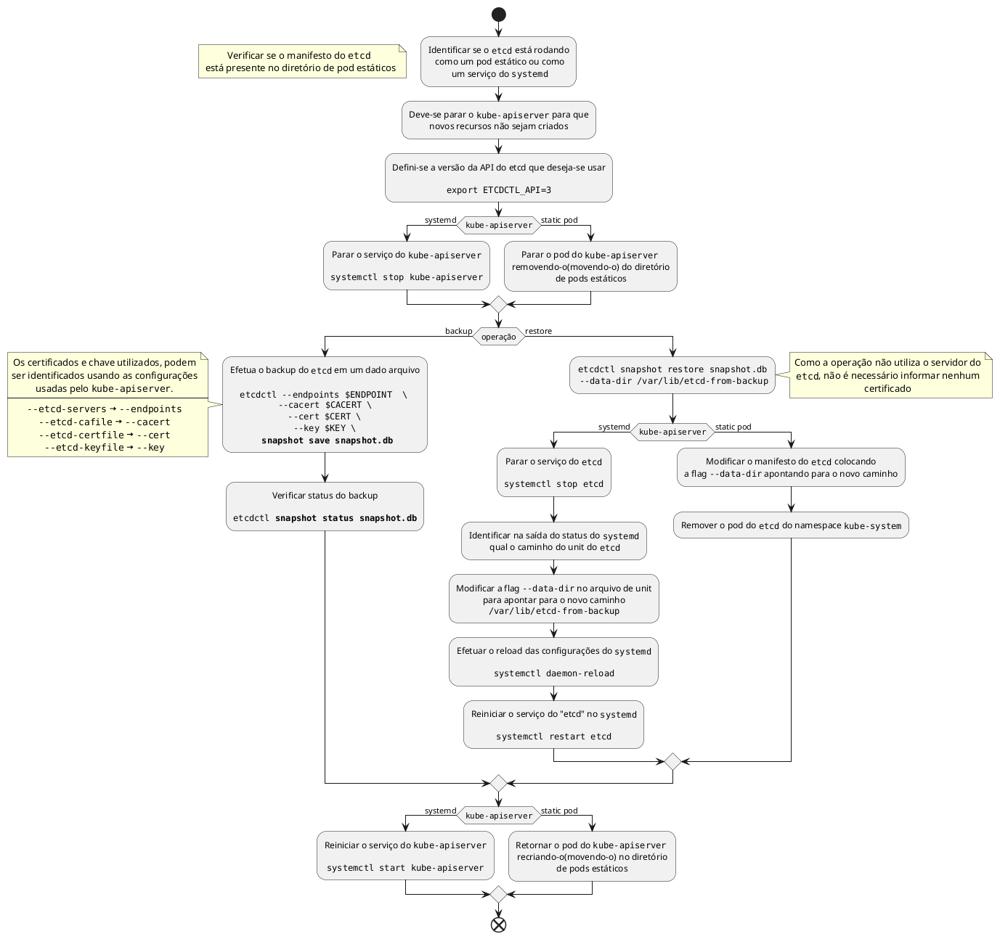

## Etcd

- `--data-dir`é a flag que mostra qual é o diretório que guarda os dados do etcd


```shell
ETCDCTL_API=3 etcdctl snapshot save snapshot.db
```

- pra restaurar primeiro para-se o [[kube-apiserver]]

```shell
ETCDCTL_API=3 etcdctl snapshot restore snapshot.db --data-dir /var/lib/etcd-from-backup
```

- configurar o etcd data-dir para apontar para o novo caminho
- reload daemon
- restart etcd
- restart [[kube-apiserver]]
- é necessário informar o
	- `--endpoints=https://127.0.0.1:2379`
	- `--cacert=/etc/etcd/ca.crt`
	- `--cert=/etc/etcd/etcd-server.crt`
	- `--key=/etc/etcd/etcd-server.key`


