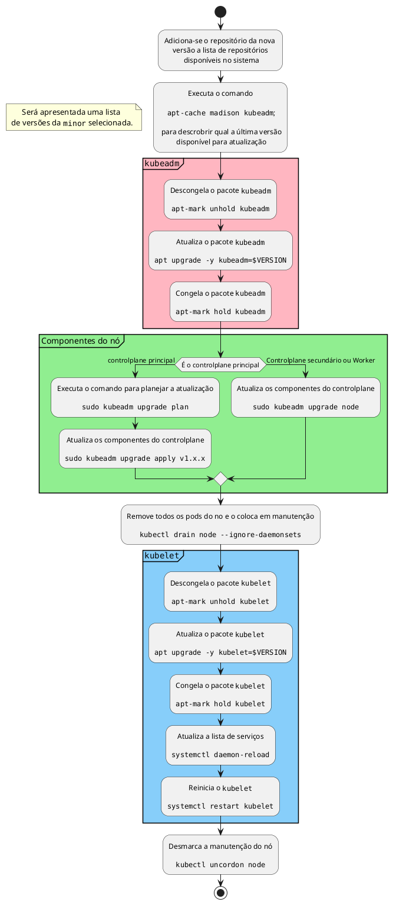

- os componentes do controlplane não precisam todos estarem na mesma versão
- porém nenhum outro componente pode estar acima da versão do [[kube-apiserver]]
- o [[kube-controller-manager]] e o [[kube-scheduler]] podem estar em uma versão abaixo
- o [[kubelet]] e o [[kube-proxy]] podem estar a duas versões abaixo
- o[[Kubectl]]pode estar a uma versão abaixo ou uma versão acima do [[kube-apiserver]]
- O suporte do kubernetes são somente para as três últimas versões lançadas
- Para fazer o upgrade é necessário subir uma minor por vez
- Primeiro se atualiza os controlplanes, depois os workernodes
	- durante a atualização, o [[kube-apiserver]] e o [[kube-scheduler]] ficarão fora por um tempo
	- TODAS as funcionalidades de manutenção serão paradas, porém, as aplicações nos worker nodes continuarão a funcionar
- O Kubeadm NÃO vai atualizar o kubelet

