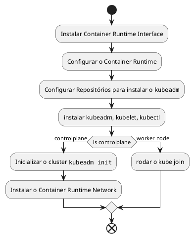

-  Primeiro instalar o container runtime: Containerd
- Instalar kubeadm

```plantuml
@startuml
start
:Instalar Container Runtime Interface;
:Configurar o Container Runtime;
:Configurar Repositórios para instalar o ""kubeadm"";
:instalar kubeadm, kubelet, kubectl;

if (is controlplane) then(controlplane)
	:Inicializar o cluster ""kubeadm init"";
	:Instalar o Container Runtime Network;
else (worker node)
	:rodar o kube join;
endif

end

@enduml
```