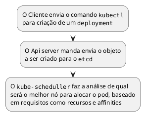

- Se o kubectl não estiver respondendo é o kubeapi server que não está funcionando...
	- Olhar com critrl o que está acontecendo
- Se um pod está em pending state e nàoi alocado nenhum nó, é o scheduler
- Se ao scalar a aplicação, não  é escalado, é o controller manager

![[troubleshhoting-procedure.png]]

## Aplicação
- Assim que é executado um pod run, o scheduler vai buscar por pods que possar rodar a aplicação
- Achando, a imagem do pod será baixada para o nó
- Os containers dos pod começarão a rodar, e o entrypoint será chamado
- Dependendo no  estado do container no entrypoint, a `pod.spec.restartPolicy` entrará em ação

- Estados de um pod
	- **Pending** - A requisição foi autenticada e autorizada pelo admission controller e o registro foi criado no etcd, mas alguns prerequisitos não foi alcançados;
	- **Running** - Todos os procedimentos deram certo
	- **Completed** - É uma task e não uma Long running task, e ela foi executada com sucesso
	- **Failed** - O pod foi finalizado, mas algum problema aconteceu
	- **CrashLoopbackOff** - Houve um erro no pod e o cluster está o restartando

- Em caso de erros, usa-se o `kubectl describe pod`
- Observar o exitCode dos containers, se el for diferente de 1, é por que deu erro no entrypoint, e é necessário um `kubectl logs --previous` pare olhar os logs da aplicação containerizada 

## Redes
f
