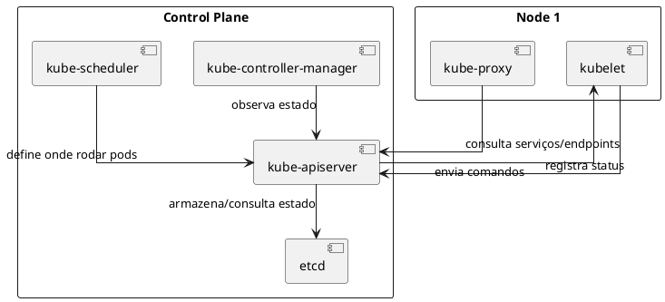

```plantuml
@startuml

skinparam linetype ortho
skinparam monochrome true
skinparam packageStyle rectangle
skinparam backgroundColor white

' Control Plane
package "Control Plane" {
    [kube-apiserver] as APIServer
    [kube-controller-manager] as ControllerManager
    [kube-scheduler] as Scheduler
    [etcd]
}

' Worker Nodes
package "Node 1" {
    [kubelet] as Kubelet1
    [kube-proxy] as Proxy1
}

' Control Plane communications
APIServer --> etcd : armazena/consulta estado
ControllerManager --> APIServer : observa estado
Scheduler --> APIServer : define onde rodar pods

' Node 1
Kubelet1 --> APIServer : registra status
Proxy1 --> APIServer : consulta serviços/endpoints
APIServer --> Kubelet1 : envia comandos

@enduml
```
